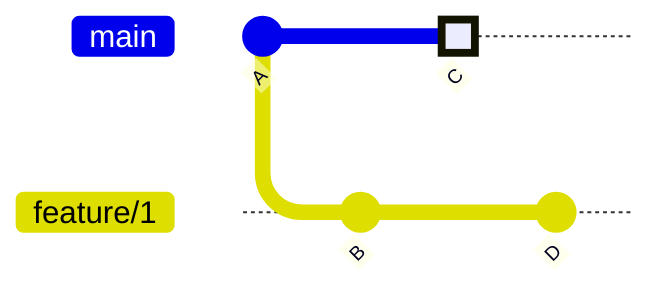
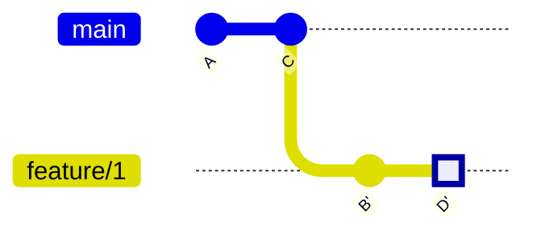
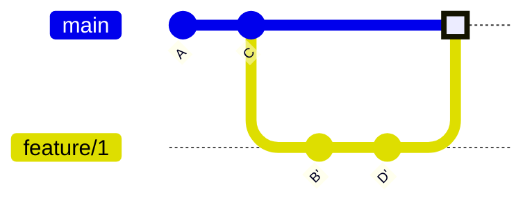

# Rebasing

Merging ist der einfachste Weg Änderungen von einen auf einen anderen Branch zu überführen. Jedoch gibt es in Git noch eine weitere Möglichkeit: Rebasing.
Im Gegensatz zum Merging werden beim Rebasing alle Commits des Quellbranches auf den Zielbranch übertragen. Es wird also kein einziger Merge-Commit erstellt, sondern die Commits mitsamt deren Änderungen werden von Quellbranch auf an den Zielbranch angehängt.



```bash
$ git checkout feature/1 # wir wählen immer den Branch aus, den wir verschieben wollen
$ git rebase main
# oder
$ git rebase main feature/1
```



Achte insbesondere auf die Commit-IDs. Der Commit `B` wurde nicht einfach nur verschoben sondern neu auf `C` angewendet. Die Meta-Daten, aber nicht der Inhalt haben sich verändert. Das bedeutet, dass der Commit `B` eine neue Commit-ID `B'` bekommt. Nachdem `B` erfolgreich angewendet wurde, wird `D`auf `B'` angewendet und erhält die neue Commit-ID `D'`.

Sollten wir wir main auf dem gleichen zusammengeführten Stand, wie `feature/1` haben wollen, können wir dies mit dem bereits bekannten Fast-Forward-Merge erreichen.

```bash
$ git checkout main
$ git merge feature/1
```



## Rebase Konflikte

Wie auch beim Merging kann es beim Rebasing zu Konflikten kommen. Wie wir diese lösen können, hast du schon beim Merging gelernt. Nach Beheben und hinzufügen zur Staging Area, fahren wir mit `git rebase --continue` fort.

Wir sehen, dass wir keine neuen Commits erstellen (Es fehlt das `git commit` vom Merging). Stattdessen schreiben wir bereits vorhandene Commits um.

> Wie auch beim Merging können wir den Rebase-Vorgang mit `git rebase --abort` jederzeit abbrechen. Der Zustand vor Begin des Rebasings wird dann wieder hergestellt

# Rebase vs. Merge

Rebase vs. Merge ist in der Git-Community so etwas wie eine Grundsatzdiskussion.
Das Merge-Lager argumentiert, dass Merge-Commits die Historie unverändert abbilden und dass damit der Verlauf der Entwicklung durchgehend nachvollziehbar bleibt. Im Kontrast dazu verändert schreibt Rebasing die Historie um.

Die Rebase Anhänger sehen sich eher in der Perspektive von Autoren. Nicht der erste Entwurf ist immer gut nachvollziehar. Deshalb schreiben Sie die Geschichte im Nachhinein um, um sie für andere besser verständlich zu machen.

In der Praxis ist es eine Frage des persönlichen Geschmacks und des Projekts. Für das Teamprojekt bietet sich vermutlich aber eine Kombination aus beiden an. Rebasing für den eigenen Branch bis Commits sehr einfach für andere Nachvollziehbar sind und Merging für das Zusammenführen von Feature-Branchen auf den Main-Branch.
