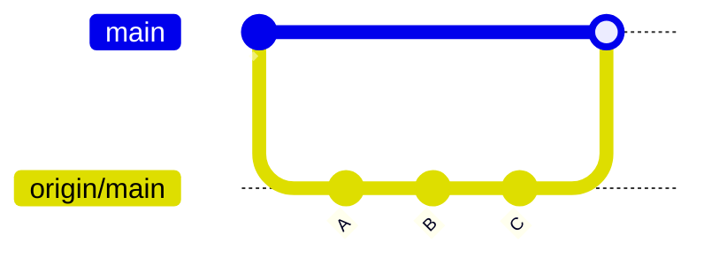
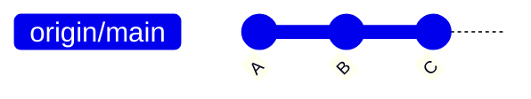
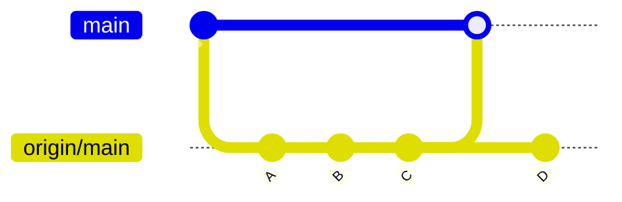
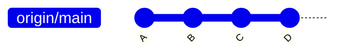
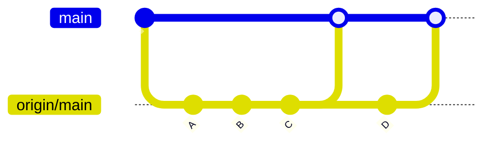
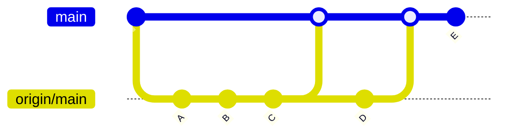
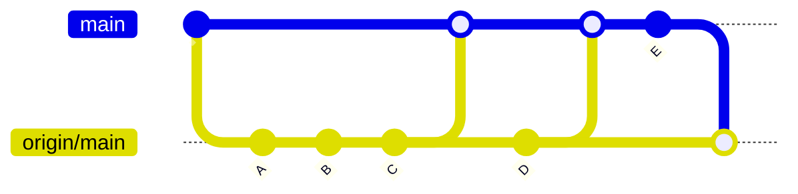
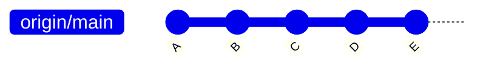

# Remotes

Bis jetzt haben wir uns sehr viel mit lokaler Version History beschäftigt und du hast nahezu alles gelernt was man braucht um git zu meistern. Bis jetzt haben wir aber gits Konzept zur Kollaboration mit anderen noch nicht angesprochen. Das ist der Punkt an dem Remotes ins Spiel kommen.

## Wir und der Server

Das klassische Client-Modell sollte jedem sein Begriff sein. Mehrere Clients greifen auf einen Server zu. Der Server ist der zentrale Punkt an dem alle Clients ihre Daten ablegen und abrufen. Git verfolgt hier einen ähnlichen Ansatz. Der Server ist in diesem Fall ein Remote Repository und die Clients sind unsere lokalen Repositories. Aber wie können wir diese beiden miteinander kombinieren?

## Remote Branches

Branches kennen wir ja bereits sehr gut. Mit ihren können wir unsere Arbeit in verschiedene Richtungen aufteilen und später wieder zusammenführen. Grade das Zusammenführen ist für uns jetzt wichtig. Wir wollen unsere Arbeit mit der Arbeit anderer zusammenführen. Klingt vertraut? Das ist genau das was wir mit Merging und Rebasing gemacht haben. Der Server ist für uns also nichts weiter als weitere Branches auf die wir unsere Arbeit zusammenführen können.

Anders als unsere lokalen Branches arbeiten wir auf unseren Remote Branches nicht mit `git commit` sondern mit `git push` und `git pull`. Aber lass uns das erstmal Konzeptuell verstehen.

Am Anfang haben wir ein remote Repository (z.B. auf Github). Wir clone dieses und schaffen damit automatisch eine Verknüfung zwischen remote und local repository. Diese Verknüpfung wird standartmäßig als `origin` bezeichnet, kann aber einen beliebigen Namen haben. Mit `git remote` können wir uns alle Remote Verknüfungen anzeigen lassen.

```bash
$ git remote
> origin
```

Bei unserem Repsository gibt es eine Verknüpfung names `origin`.

> Sollten wir nicht mehr wissen wo ein Remote hinzeigt, könnten wir das und noch mehr mit `git remote show <remote_verknüfung>` anzeigen lassen. Für `origin` wäre das `git remote show origin`.

Zusätzlich hat unser Repository zwei Branches: `main` und `origin/main`. Der Branch `main` ist unser lokaler Branch und `origin/main` ist ein Remote Branch, der den Stand des Branches `main` auf dem Server wiederspiegelt.
Nach einem `git clone` sind beide Branches auf dem gleichen Stand.

Client:



Server:



Soweit so einfach. Da Server und Client nicht immer auf dem gleichen Stand sind, kann es passieren, dass beide schnell auseinander driften. Wenn der Server einen neuen Commit bekommt wird unser Remote Branch `origin/main` nicht automatisch aktualisiert. Das müssen wir manuell mit `git fetch` machen.

Wenn der Server einen neuen Commit bekommt und wir `git fetch` ausführen sieht danach unser Repository so aus:

```bash
$ git fetch origin main:main
```

> `origin main:main` ist ein bischen viel auf einmal. `origin` ist der Name der Verknüpfung auf die wir uns beziehen. Das erste `main` ist der Name des Branches auf dem Server den wir fetchen wollen und das zweite `main` ist der Name des Branches in unserem lokalen Repository in dem wir den Branch speichern wollen.

Client:



Server:



Auf main selber sind die Änderungen noch nicht angekommen. Das müssen wir manuell machen. Dafür gibt es zwei Möglichkeiten: Das klassische `git merge` oder das etwas komplexere `git rebase`. Beide Methoden kennst du bereits.
Wir entscheiden uns hier für das einfache `git merge`

```bash
$ git checkout main
$ git merge origin/main
```

Client:



Server:


Da dieser Vorgang sehr häufig vorkommt git bietet git eine Abkürzung an: `git pull`. `git pull` führt `git fetch` und `git merge` in einem Schritt aus.

```bash
$ git pull origin main:main
```

So kommen wir deutlich simpler zum gleichen Ergebnis.

> Sollten wir bereits einen Upstream für diesen Branch gesetzt haben, können wir auch einfach `git pull` ohne `origin main` ausführen. Zur Upstream später mehr

Nun zum Übertragen von Commits auf den Server. Erstellen wir dafür zunächst einen neuen Commit auf unserem Client.

```bash
$ git commit
```

Client:



Server:


Wollen wir diesen Commit auf den Server übertragen, müssen wir zunächst sicherstellen, dass wir auf dem neusten Stand vom Server sind. Sollte das nicht der Fall sein, müssen wir erst einen `git pull` durchführen. Damit wird sichergestellt, dass wir beim Pushen keine Konflikte verursachen und ein Fast-Forward-Merge auf dem Server durchgeführt werden kann.

```bash
$ git pull origin main:main
> Already up to date.
$ git push origin main:main
```

> `git push origin main:main` ist ein wenig anders als bei `git fetch` oder `git pull`. Zwar ist `origin` wieder der Name der Verknüpfung, aber das erste `main` steht hier für den lokalen Branch und das zweite `main` steht für den Branch auf dem Server. Von links nach rechts folgt es also der Reihenfolge der Operation. Für `push` : lokal -> remote für `fetch` und `pull` : remote -> lokal

Der Push-Vorgang setzt zunächst den Remote Branch auf den Stand unseres lokalen Branches und übertragt dann seine Änderungen auf den Server.

Client:



Server:



# Upstreams

Das ganze Prozedere mit `origin main:main` ist ein wenig umständlich. Deshalb lässt sich dies auch einmalig für einen Branch festlegen und danach einfach ein `git pull` bzw. `git push` ausführen. Wir checken dafür zunächst den gewünschten Branch aus und setzen den Upstream mit `git branch --set-upstream-to=<remote>/branch`.

Für den Branch `main` auf dem Server sieht das so aus:

```bash
$ git checkout main
$ git branch --set-upstream-to=origin/main
# oder kürzer
$ git checkout main
$ git branch -u origin/main
```

> Bei einem Clone wird der Upstream automatisch für den Branch gesetzt. Das heißt für ein geclontes Repository ist `git pull` und `git push` ohne weiteres für `main` möglich.
