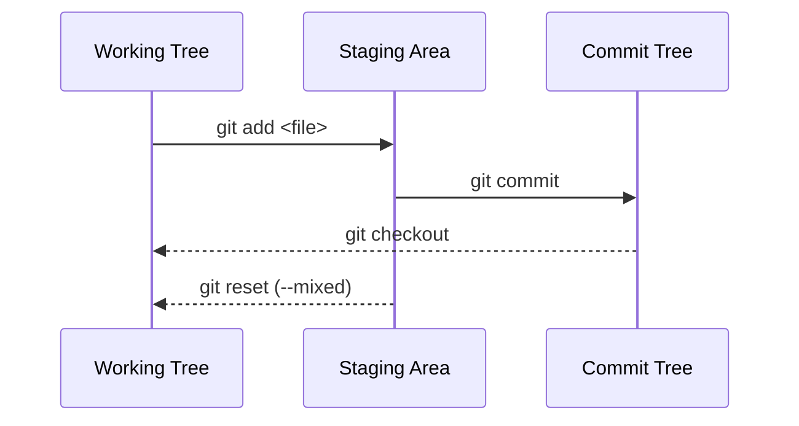

# Staging und Working Area

Bis jetzt hat unser Datenmodell sowie unser frisch erstelltes Repository noch keinen Bezug zu unseren "normalen" Dateien, so wie wir sie aus unserem Finder oder Explorer kennen. Wir kennen unseren Commit Tree und unser Dateisystem, aber wie stehen diese miteinander in Interaktion?

## Working Area (Working Tree)

Das ganz normale Dateisystem in git wird auch als Working Area bezeichnet. Wie der Name bereits indikiert, ist dies der Bereich, in dem wir wie gewohnt arbeiten. Wir erstellen Datein, löschen Datein, ändern Datein, etc. Hier ist also nahezu alles gleich - mit oder ohne git.

## Staging Area

Jetzt könnten wir, um unser Commit Tree zu integrieren einfach alle Datein in unserem Working Directory zu bestimmten Zeitpunkten als Commit unserem Datenmodell hinzufügen. An sich ist daran nichts falsch, jedoch ist es nicht besonders flexibel. Was wenn wir nur Teile unserer Datein committen also zu einem bestimmten Zeitpunkt festhalten wollen. Oder nur bestimmte Änderungen in einer Datei festgehalten werden sollen.
Hier kommt die Staging Area ins Spiel. Die Staging Area ist wie ein Warenkorb beim Onlineshopping. Wir können Sachen rein legen und wieder rausnehme, wenn wir uns doch unsicher sind. Und erst wenn wir sicher sind, dass wir alles haben was wir wollen, gehen wir mit unserem Warenkorb zur Kasse (dem finalem Commit erstellen). Wir haben also die Möglichkeit nochmals zu überprüfen, ob wir genau das wollen was wir haben.

Um unseren Datein aus der Working Area in den Warenkorb - die Staging Area - zu legen, verwenden wir den Befehlt `git add`.

Schauen wir uns das an einem Beispiel an:

```bash
+-- my_git_repo
    +-- .git/...
    +-- src
    |   +-- foo
    |   |   +-- foo.txt
    |   |   +-- bar.txt
    +-- config.toml
```

Der `.git` Ordner ist schon vorhanden. Unser Ordner ist allso schon ein git Repository. Wir haben bereits ein paar leere Datein erstellt und bis jetzt noch nichts unserem commit tree hinzugefügt.
Wir können das sehr schön überprüfen, indem wir uns den aktuellen Status des Repositories anzeigen lassen:

```bash
$ git status
> On branch main

  No commits yet

  Untracked files:
    (use "git add <file>..." to include in what will be committed)
	  config.toml
	  src/

  nothing added to commit but untracked files present (use "git add" to track)
```

Was sehen wir hier? Es existiert der Branch `main` und unser HEAD befindet sich akutell dort. Jedoch gibt es noch keinen Commits in unserem Repository.

Git zeigt uns aber schon an, dass es Datein gibt, die noch nicht getrackt - noch nie in einem Commit festgehalten - wurden

> Die Empfehlungen die git uns gibt, finden sich in nahe zu jeder Ausgabe von git und sind oft genau dass was wir machen wollen. Es lohnt sich also, diese zu lesen.

Um unsere Datein zu tracken, müssen wir sie zuerst unserer Staging Area hinzufügen:

```bash
  $ git add config.toml
  $ git add src/
```

Beim ersten `add` fügen wir nur `config.toml` hinzu. Beim zweiten `add` fügen wir den gesamten Ordner `src/` sammt aller Datein hinzu. Alternativ können wir das auch als ein Befehl schreiben:

```bash
  $ git add config.toml src/
```

> Theoretisch können wir auch sehr simple alle Änderungen und Datein der Staging Area hinzufügen:
>
> ```bash
>   $ git add .
> ```
>
> Auch wenn das kurzfristig sehr praktisch aussieht, würde ich davon abraten. Sehr oft geraten dabei Datein in die Staging Area und in den darauffolgenden Commit, die nicht da sein sollten. Was genau in einen Commit sollte schauen wir uns später im Kontekt der Softwareentwicklung an.

Wenn wir jetzt nochmal den Status unseres Repositories abfragen schaut das ein wenig anders aus:

```bash
$ git status
> On branch main

  No commits yet

  Changes to be committed:
    (use "git rm --cached <file>..." to unstage)
	  new file:   config.toml
	  new file:   src/foo/bar.txt
	  new file:   src/foo/foo.txt
```

Unter `Changes to be committed` sehen wir jetzt die Datein, die wir gerade der Staging Area hinzugefügt haben.

# Commit

Der einzige Schritt der jetzt noch fehlt ist alle Änderungen von der Staging Area in einen Commit zu überführen. Das machen wir mit dem Befehl `git commit`. Sei dabei sicher, dass du nur Datein in der Staging Area haben möchtest, die auch wirklich in den Commit sollen.
In unserem Fall möchten wir alle neu erstellten Datein in den Commit packen.

```bash
$ git commit
> [main (root-commit) 3adf051] Initial commit
 3 files changed, 0 insertions(+), 0 deletions(-)
 create mode 100644 config.toml
 create mode 100644 src/foo/bar.txt
 create mode 100644 src/foo/foo.txt
```

Nachdem ihr den Befehl ausgeführt habt, öffnet sich ein Editor. Hier könnt ihr eine Commit Message schreiben. Diese sollte kurz und prägnant sein und beschreiben, was ihr in diesem Commit gemacht habt. Wenn ihr den Editor schließt, wird der Commit erstellt. Solltet ihr nur eine kurze Nachricht haben können wir diese auch direkt in der Shell hinzufügen:

```bash
  $ git commit -m "Initial commit"
  > [main (root-commit) 3adf051] Initial commit
   3 files changed, 0 insertions(+), 0 deletions(-)
   create mode 100644 config.toml
   create mode 100644 src/foo/bar.txt
   create mode 100644 src/foo/foo.txt

```

Wenn wir jetzt den Status unseres Repositories abfragen ist die Ausgabe deutlich kürzer:

```bash
$ git status
> On branch main
  nothing to commit, working tree clean
```

Unsere Staging Area ist leer und in unserer Working Area (working tree) gibt es keine Änderungen im Vergleich zum letzten Commit.



Die ersten Schritte vom Working Tree zum Commit Tree kennen wir ja schon. Aber was passiert, wenn wir einen Fehler gemacht haben und die Datei wieder aus der Staging Area entfernen wollen? Oder wir auf unseren letzten Commit zurück wollen? Das und viels mehr schauen wir uns auf der nächsten Seite an.

> Was machen wir mit Datein, die wir niemals Tracken wollen. Zum Beispiel weil sie sensible Informationen enthalten oder viel zu groß sind? Dafür gibt es die `.gitignore` Datei. In dieser Datei können wir Datein oder Ordner angeben, die git vollständig ignorieren soll. Einfach die Datei im top-level Ordner des Repositories erstellen und die Datein oder Ordner angeben, die ignoriert werden sollen. Mehr dazu in der [Dokumentation](https://git-scm.com/docs/gitignore).
