# Installation mit Coursier (im Helpdesk getestet)

_Props an Selin für die Screenshots! :)_

## 1. Scala, SBT und JDK über Coursier installieren

Ladet euch [den offiziellen, auf Coursier basierenden Installer](https://github.com/coursier/launchers/raw/master/cs-x86_64-pc-win32.zip) ([Quelle](https://docs.scala-lang.org/getting-started/index.html)) herunter - es sollte sich um eine Zip-Datei handeln. Diese müsst ihr dann mit Rechtsklick -> "Alle Extrahieren" entpacken.

In dem entpackten Ordner findet sich eine EXE-Datei, die ihr als Administrator ausführen müsst. Wenn ihr das macht, wird eine Warnung erscheinen "Ihr Computer wurde geschützt" - dann müsst ihr im Text darunter auf "Mehr Informationen"(oder so, ist auf jeden Fall unterstrichen) klicken, dann erscheint der Button "Trotzdem ausführen". Das sieht dann z.B. so aus:
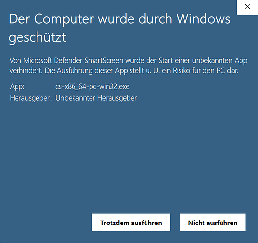

Ihr müsst außerdem bestätigen, dass das Installationsprogramm Änderungen an eurem Computer vornimmt.

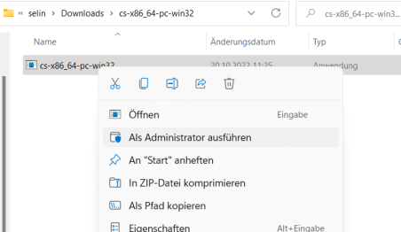

Es erscheint dann ein Terminalfenster, wo ihr mit `Y` bestätigen könnt, dass Scala etc. zum Pfad hinzugefügt werden - das funktioniert aber nicht und müssen wir später manuell machen.

> In dem Terminal werden viele Dateien heruntergeladen, was etwas dauern kann, danach erscheint für jeden installierten Bestandteil eine Meldung "Installed cs", dann schließt sich das Fenster. Wenn keine Internetverbindung besteht, bricht der Installer ab und das Fenster schließt sich ebenfalls - im Zweifelsfall einfach nochmal ausführen, das kann nix kaputt machen!

## 2. Umgebungsvariable PATH anpassen

Damit Scala, SBT und Co im Terminal gefunden werden, müssen wir den Installationsordner zur Umgebungsvariable PATH hinzufügen.

### Installationsordner finden

Als erstes suchen wir den Installationsordner, an dem die ausführbaren Dateien liegen. Dafür müssen wir versteckte Dateien und Ordner anzeigen:

Im Windows-Dateiexplorer auf die drei Punkte rechts oben klicken und dann auf "Optionen"
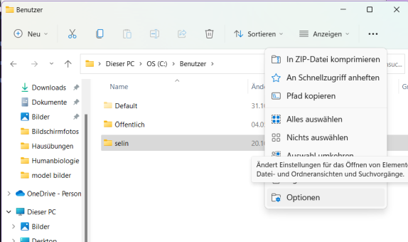

Im dann geöffneten Fenster den Reiter "Ansicht" wählen, unter den Erweiterten Einstellungen runterscrollen zu "Versteckte Dateien und Ordner" und "Ausgeblendete Dateien, Ordner und Laufwerke anzeigen" auswählen.

Wenn ihr das getan und mit "OK" bestätigt habt, solltet ihr in eurem Benutzerordner den Ordner "AppData" finden:
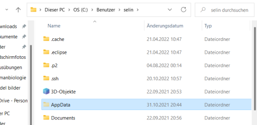
...dadrin solltet ihr im Unterordner "Local" einen Ordner "Coursier" finden:
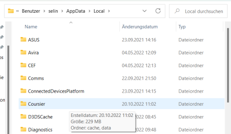
...und wenn ihr dann in den Ordner "data" und darin "bin" wechselt, sollte das in etwa so aussehen:
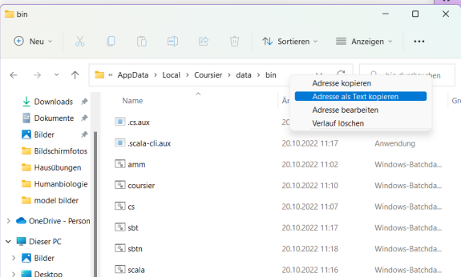
Wenn ihr nun in die Adresszeile Rechtsklickt, könnt ihr diese Adresse als Text kopieren.

### Umgebungsvariable PATH anpassen

Wenn ihr eure Einstellungen öffnet und in der Suchleiste "Erweiterte System" eingebt, kommt ihr zu den erweiterten Systemeinstellungen:
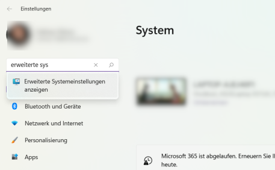
Dort findet ihr im Reiter "Erweitert" rechts unten die Umgebungsvariablen:
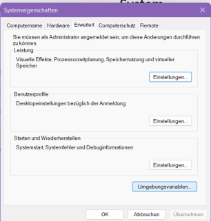
Hier müsst ihr dann runterscrollen zur Variable "Path", auswählen und auf "Bearbeiten" klicken:
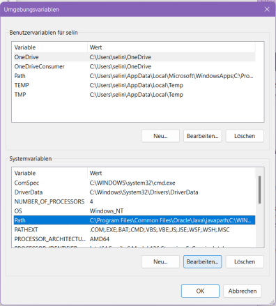
Durch einen Klick rechts oben auf "Neu" könnt ihr dann eine neue Zeile hinzufügen...
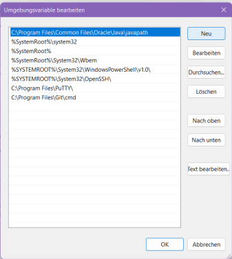
...in die ihr dann den im ersten Schritt kopierten Pfad einfügen könnt:
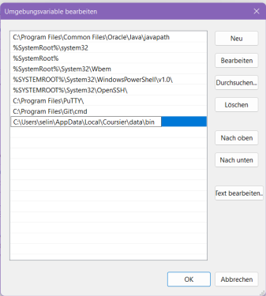

Dann alles mit "OK" bestätigen, und der Pfad sollte gesetzt sein!
Damit die Änderung Effekt hat, müsst ihr nun euer Terminal neu öffnen.

### RICHTIGES Terminal öffnen

In Windows gibt es verschiedene Terminals. Wenn ihr Git verwenden wollt, könnt ihr mit Rechtsklick in einem Ordner einfach Git Bash öffnen. Was sich öffnet, wenn ihr in einem Ordner rechtsklickt und "Terminal öffnen" klickt, ist aber eine **Windows Powershell (TM), in der Scala, SBT und so nicht funktionieren!**

Was ihr braucht, ist ein Command Prompt, oder auf Deutsch "Eingabeaufforderung". Den findet ihr am schnellsten, indem ihr nach "cmd" sucht:
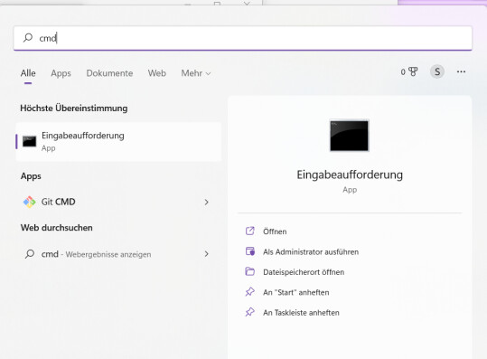

Wenn ihr die Eingabeaufforderung geöffnet habt, könnt ihr direkt mal testen, ob z.B. Scala da ist:

Nun befindet ihr euch, wie ihr am Anfang der Eingabeaufforderung seht, in eurem Benutzerverzeichnis - für die Hausübung müsst ihr aber manchmal Befehle woanders ausführen. Mithilfe des Befehls `cd` könnt ihr in einen anderen Ordner wechseln.

- `cd ..` führt euch in den Elternordner des aktuellen Ordners
- Wenn ihr nach `cd` eine wie oben aus der Explorer-Adresszeile kopierte Adresse einfügt, sollte das auch funktionieren
- mithilfe von `dir` könnt ihr euch den Inhalt des aktuellen Ordners ausgeben lassen. In einen dieser Unterordner könnt ihr auch wechseln, indem ihr nach `cd ` einfach nur seinen Namen eingebt.

# Manuelle Installation

### 1. JDK installieren

Falls nicht bereits vorhanden, müsst Ihr zunächst ein Java SE Development Kit (JDK) installieren. Ladet euch [hier](https://www.oracle.com/java/technologies/downloads/#jdk19-windows) den JDK-Installer herunter und startet die Installation.

### 2. sbt installieren

[Hier](https://www.scala-sbt.org/1.x/docs/Installing-sbt-on-Windows.html) findet Ihr einen Windows (msi) Installer. Diesen müsst ihr nur herunterladen und die Installation starten.

> **Achtung**: Je nach Gerät könntet Ihr gefragt werden, ob Ihr die Installation tatsächlich durchführen wollt. Der Windows Installer ist von _sbt_ selbst und sollte demnach so bedenkenlos sein, wie die Installationen über Packagemanager wie **_Chocolatey_** oder **_Scoop_**. Ihr könnt aber auch diese Software verwenden, um _sbt_ zu installieren. [Hier](https://www.scala-sbt.org/1.x/docs/Installing-sbt-on-Windows.html) wird erklärt, wie das funktioniert.

---

Sollte bei Euch etwas nicht funktionieren oder solltet Ihr noch Fehler o.ä. finden, antwortet gerne auf diesen Post, sodass ich den Wiki-Eintrag aktualisieren kann.
