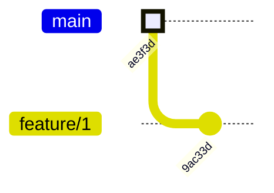
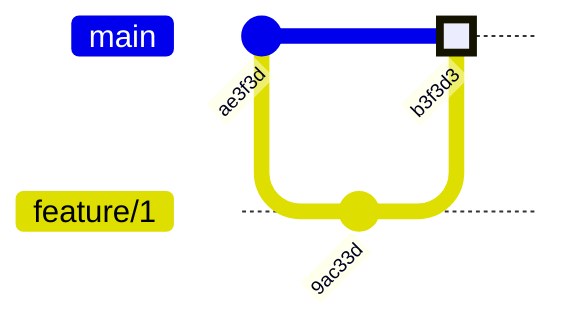
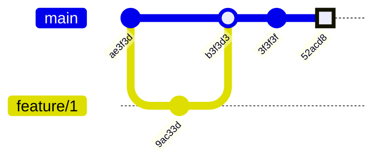
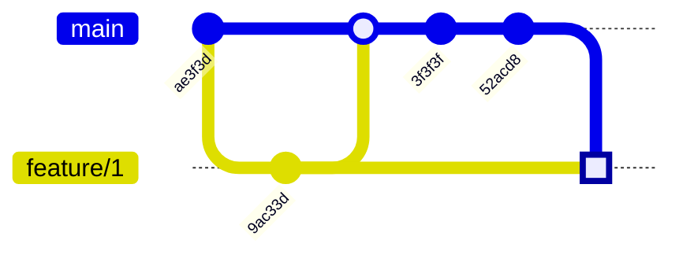
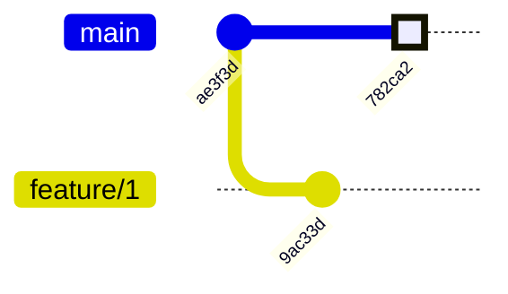
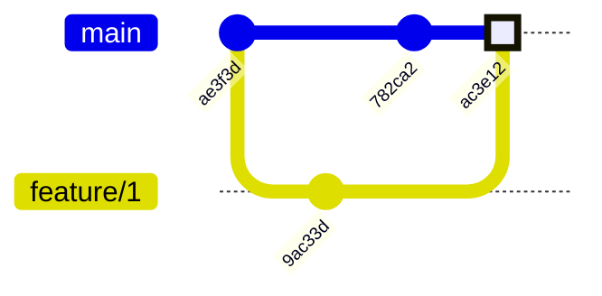

# Branching und Merging

# Branching

Wir haben bereits viele Commit Trees gesehen und meistens waren diese nicht nur linear, sondern hatten bereits mehrere Branches. Was Branches sind haben wir bereits gesehen, aber wie können wir diese erstellen.

Wir begeben uns in unserem Repository mittel `checkout` an den Commit, von dem wir aus einen neuen Branch erstellen wollen. Das kann ein Branch wie `main` sein oder auch ein Commit, der schon länger zurückliegt. Dort angekommen erstellen wir einen neuen Branch mit dem Befehl `git branch <branch_name>`.
Wollen wir also den Branch `feature/1` von `main` erstellen, machen wir folgendes:

```bash
$ git checkout main
$ git branch feature/1
```

Bevor wir nun Commits unserm neunen Branch hinzufügen können, müssen wir noch auf unseren neu erstellten Branch wechseln:

```bash
$ git checkout feature/1
```

Wahlweise können wir auch das Erstellen und Wechseln in einem Befehl durchführen:

```bash
$ git checkout -b feature/1
```

> Die `-b` Flag steht hierbei für `branch`.

In git gilt der Grundsatz: "Branch early, branch often". Das heißt du wirst in der Regel mit vielen Branches konfrontiert sein. Diese alle über das Log zu verfolgen ist nicht immer sinnvoll. Solltest du einfach nur wissen wollen, welche Branches es gibt, kannst du das mit dem Befehl `git branch` tun.

```bash
$ git branch
> * feature/1
  main
```

Der aktuelle Branch (HEAD) ist mit einem `*` markiert.

Nach einem [Merge](./branching_und_merging.md#Merging) oder [Rebase](./rebase_und_cherry_picking.md#Rebasing), wenn alle Änderungen auf einem anderen Branch übernommen worden sind, können wir den alten Branch löschen. Das machen wir mit dem Befehl `git branch -d <branch_name>`.

Sollten wir also `feature/1` wieder löschen wollen, schaut das wie folgt aus:

```bash
    $ git branch -d feature/1
```

> Wie das Löschen wieder Rückgängig gemacht werden kann findest du [hier](./help.md)

# Merging

Merging hatten wir bereits ganz am Anfang in Kombination mit dem Datenmodell angesprochen. Beim Merging wollen wir die Änderungen aus zwei unterscheidlichen Branches zusammenführen. Dabei wird die Änderungen des einen Branches mit einem Merge-Commit auf den anderen übernommen. Der Merge-Commit hat zwei oder mehrere Parent-Commits ist ansonsten aber identisch zu einem normalen Commit.

> Wichtig: Nur der Pointer des Zielbranches wird auf den Merge-Commit verschoben. Der Pointer vom Quellbranch bleibt unverändert.

In git mergen wir mit dem Befehl `git merge <quell_branch>` der Zielbranch ist dabei immer der Branch auf dem sich grade HEAD befindet.

Schauen wir uns das denkbar einfachste Beispiel an:



```bash
$ git merge feature/1
```



Alle Änderungen von `feature/1` wurden auf `main` übernommen. Auf `feature/1` hat sich nichts verändert. Es befinden sich dort nur die Commits, die es auch schon vorher gab.

## Fast-Forward Merges

Sollten wir jetzt auf `main` ein paar Commits hinzufügen und dann `main` in `feature/1` mergen (andersherum als vorhin), wird interessanter Weise kein neuer Merge-Commit erstellt.



```bash
$ git checkout feature/1
$ git merge main
```



Unser aktueller HEAD ist kein neuer Commit (kein Hash), sondern stattdessen wir der Pointer von feature/1 einfach auf den letzten Commit von `main` gesetzt. Git erkennt, dass es keine Änderungen auf `feature/1` gibt, die nicht auch auf `main` sind und somit `main` und `feature/1` identisch sind. Ein solcher Merge wird als Fast-Forward Merge bezeichnet.

> Fast Forwad Merges garantieren einen konfliktfreien Merge. Das bedeutet, dass es keine Merge-Konflikte geben kann.

# Merge Conflicts

Im starken Kontrast zu Fast-Forward Merges stehen Merge Konflikte. Diese entstehen, wenn Änderungen auf zwei Branches gemacht wurden, die sich gegenseitig widersprechen. Git ist dann nicht mehr in der Lage automatisch beide Dateien zusammenzuführen und ein manueller Eingriff ist erforderlich.

Unser Commit Tree schaut aktuell wie folgt aus.



Im ersten Commit (`ae3f3d`) haben wir die Datei foo.txt mit dem Inhalt `Hello World` erstellt. Im zweiten Commit (`9ac33d`, feature/1) haben wir die Datei foo.txt auf `Hello Alice!` geändert. Und auf `main` haben wir die Datei foo.txt auf `Hello Bob!` geändert.

```bash
# == Ursprünglich ==
$ git checkout ae3f3d
$ cat foo.txt
> Hello World

# == main ==
$ git checkout main
$ cat foo.txt
> Hello Alice!

# == feature/1 ==
$ git checkout feature/1
$ cat foo.txt
> Hello Bob!
```

Wenn wir jetzt `feature/1` in `main` mergen wollen, wird es zwangsweise zu einem Merge-Konflikt kommen, da nicht klar ist ob es "Hello Alice" oder "Hello Bob" heißen soll.

```bash
$ git checkout main
$ git merge feature/1
> Auto-merging foo.txt
  CONFLICT (content): Merge conflict in foo.txt
  Automatic merge failed; fix conflicts and then commit the result.
```

Wie wir sehen, ist es zu einem Konflikt gekommen. Git hat versucht die Datei foo.txt automatisch zusammenzuführen, ist aber gescheitert. Es wurde somit auch noch kein Merge-Commit erstellt. Jediglich der Merge-Konflikt wurde in der Datei foo.txt markiert. Deshalb zeigt uns `git status` auch eine Änderung an der Datei `foo.txt` an:

```bash
$ git status
> On branch main
  You have unmerged paths.
    (fix conflicts and run "git commit")
    (use "git merge --abort" to abort the merge)

  Unmerged paths:
    (use "git add <file>..." to mark resolution)
	  both modified:   foo.txt

  no changes added to commit (use "git add" and/or "git commit -a")

```

Schauen wir uns mal an wie so ein Merge-Konflikt in der Datei aussieht:

```bash
$ cat foo.txt
> <<<<<<< HEAD
  Hello Alice!
  =======
  Hello Bob!
  >>>>>>> feature/1
```

Die Datei wurde in zwei Teile aufgeilt. Oben befindet sich immer der Stand von HEAD also in unserem Fall `main`. Ein `=======` trennt beide Teile. Unten befindet sich der Stand von `feature/1`. Um den Konflikt zu lösen, müssen wir die Datei so bearbeiten, dass sie nur noch den gewünschten Stand enthält und alle Konflikt-Markierungen entfernt sind. In unserem Fall wollen wir `Hello Alice!` und `Hello Bob!` zu `Hello Alice and Bob!` zusammenführen. Wir ändern das in unserem Editor und speichern die Datei. Jetzt schaut `foo.txt` so aus:

```bash
$ cat foo.txt
> Hello Alice and Bob!
```

Um git mitzuteilen, dass wir den Konflikt zu unserer Zufriedenheit gelöst haben, müssen wir die Datei `foo.txt` mit `git add` der Staging Area hinzufügen und dann einen ganz normalen Commit erstellen.

```bash
$ git add foo.txt
$ git commit -m "Merge feature/1 into main"
```

> Solltet ihr während des Merge-Prozesses feststellen, dass ihr einen Fehler gemacht habt oder noch nicht bereit für den Merge seit, könnt ihr jederzeit den Merge mit `git merge --abort` abbrechen. Damit werden alle Änderungen zurückgestzt als ob der Merge nie angefangen wurde.

Unser Commit Tree sieht jetzt wie ein normaler Merge aus:



Egal welche Art von Konflikt ihr in git habt, die Lösung folgt immer dem gleichen Schema:

1. Konflikt in der Datei beheben und speichern
2. `git add` um die Datei in die Staging Area zu legen
3. - Für einen Merge-Konflikt einen Commit mit `git commit` erstellen.
   - Für einen Rebase-Konflikt mit `git rebase --continue` fortfahren.

> Im Allgemeinen lohnt es sich immer den git Status abzufragen (`git status`). Hier werden alle notwendigen Schritte beschrieben um den Konflikt zu lösen oder abbzubrechen.
