# Checkout und Reset

[Vorhin](./erstes_repository.md#repository-clonen) haben wir bereits gesehen wie wir `git clone` funktioniert und wie wir unser im Workshop erstelltes Beispiel clonen können. In diesem Kapitel sehen wir wie die Version History von Git in der Praxis funktioniert, wie wir uns in der History bewegen können und wie wir Änderungen rückgängig machen können. Aber bevor wir irgendwelche Änderungen an unserem Repository vornehme, sollten wir uns erstmal einen Überblick über das Repository verschaffen.

# Den Überblick behalten

Vorhin haben wir einfach den Status mit `git status` abgefragt und waren glücklich damit. Schließlich gab es ja noch keine Commits in unserem Repository. Was aber wenn wir aber schon welche haben? Hier kommt `git log` ins Spiel.

Wechseln wir in unser geclontes Repository und schauen uns die Version History von Git an:

```bash
$ cd my_git_repo
$ git log
> commit ade5234ac06311dff9f6cf5fc988bcc056533e57 (HEAD -> main)
  Author: Leon Fuss <leon.fuss@icloud.com>
  Date:   Tue Apr 16 15:58:23 2024 +0200

      added call to hello_user

  commit e0a79308cb8dd4937585c70ed462fc9a40977e55
  Merge: f239baa 656d544
  Author: Leon Fuss <leon.fuss@icloud.com>
  Date:   Tue Apr 16 15:08:28 2024 +0200

      Merge branch 'feature/hello_user'
 ...
```

Hier sehen wir die letzten Commits. Jeder commit beginnt mit dem Keyword `commit` gefolgt von seinem Commit Hash. Danach folgt das Autor, das Datum und die Commit Message. Am Obersten Commit wird immer HEAD gesetzt sein und zeigt an wie und worauf er gesetzt ist. In unserem Fall ist HEAD auf den Branch `main` gesetzt - erkennbar an `(HEAD -> main)`.

Meist gibt dieser Überblick schon genug Informationen um sich zumindest zu erinnern an was man als letztes gearbeitet hat. Für einen besseren Überblick gibt es aber bessere Optionen:

```bash
  $ git log --oneline --graph --all
  > * 90aeab1 (feature/loop) adapted for repeated echo calls
  | * ade5234 (HEAD -> main) added call to hello_user
  |/
  *   e0a7930 Merge branch 'feature/hello_user'
  |\
  | * 656d544 (feature/hello_user) added hello_user
  * | f239baa added echo functionality
  |/
  * 13db86d added ussage description to README
  * 38333e6 init rust repo
  * 85cbf15 Initial commit
```

Hier haben wir viele Optionen auf einmal verwendet. Was bewirken wir damit?

- `--oneline` zeigt die Commits in einer Zeile an. Auch der Hash wird auf die minimale eindeutige Länge gekürzt
- `--graph` zeigt die Commits in einer Grahen Darstellung. Damit können wir die Branch struktur erkennen
- `--all` zeigt alle Branches an. Ohne diese sehen wir nur die Commits die vor unserem aktuellen HEAD liegen

Die Optionen kannst du Kombineren wie du willst. Ich persönlich präferenziere die Graphen Darstellung und die einzeilige Anzeige. Das gibt mir einen guten Überblick über die Branch Struktur und die Commit Historie.

Damit wir auch wirlich verstehen was hier steht können stellen wir das ganze hier einmal in unseren bereit bekannten Graphen dar. Unser Head liegt aktuell auf dem letzten Commit von `main` (umrandet):

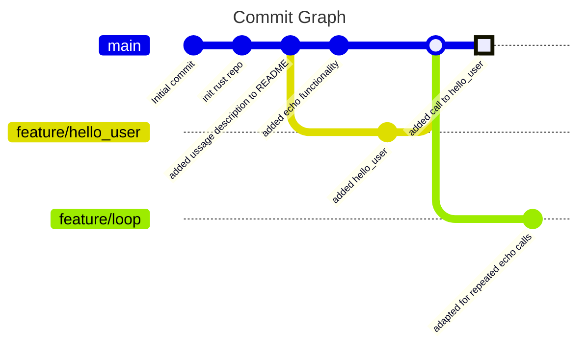

Hier haben wir der Klarheit halber die Commit Messages als Commit ID verwendet. Das sollte dir helfen zu verstehen wie die Commits in der Historie zueinander stehen. Normalerweise würden wir hier die Commit Hashes verwenden.

> Wollen wir nur die Commits eines bestimmten Files sehen, können wir das mit `git log <file_name>` tun.

# Checkout

Jetzt wo wir unsere Karte haben, können wir uns im Commit Graph bewegen. Aber was meint das eigentlich?

> Im folgenden setzten wir ein cleanes Repository voraus. Das heißt, dass der Working Tree mit dem letzten Commit übereinstimmt und die Staging Area leer ist. `git log` sollte dann so auschauen:
>
> ```bash
> $ git log
> > On branch main
>   nothing to commit, working tree clean
> ```
>
> Was wir machen können, wenn das nicht der Fall ist siehst du [hier](./checkout_und_reset.md#stashing)

Hast du noch unser Diagramm zu Working und Commit Tree sowie der Stashing Area im Kopf?:

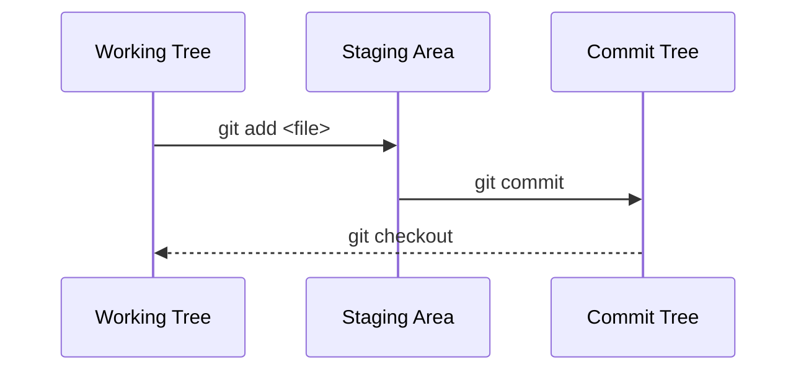

Hier gab es schon einen kleinen Hinweis darauf was passiert, wenn wir um Commit Tree herumwandern. Jedes Mal wenn wir uns einen vergangen Commit ansehen, wird der Inhalt des Working Tree auf den Stand des ausgewählten Commits gebracht. In der git Welt nennen wir das `checkout`.
Diese Überschreibung unseres Working Trees ist auch der Grund warum wir immer darauf achten sollten, dass unser Working Tree sauber ist bevor wir uns in der Historie bewegen. Sollten wir ungespeicherte (nicht commited) Änderungen haben, werden diese überschrieben. Aber keine Sorge: git lässt uns nicht einfach in den Abgrund laufen. Sollten wir ungespeicherte Änderungen haben, wird uns einen wechsel verweigern bis wir einen cleanen Working Tree haben.

> Commit oder doch Branch? Der Unterschied wird jetzt wichtig für uns. Falls du nicht mehr ganz sicher bist, lies nochmal [hier](./datenmodell_git.md#besonderheiten-von-branches)

Bei einem Checkout passieren zwei Dinge:

1. Der HEAD wird auf den ausgewählten Branch/Commit/Tag gesetzt
2. Der Working Tree wird auf den Stand des ausgewählten Branch/Commit/Tag gebracht

Erinnerst du dich wie Braches immer auf den aktuellsten Branch ihres Zweiges zeigen? Wenn wir auf dem Branch Commiten wir auch der Branch Pointer auf den letzen Commit verschoben. Ähnlich zum Branch ist auch der HEAD nur ein Pointer. Setzen wir den Pointer auf einen Branch und der Branch bewegt sich, wird auch der HEAD auf den neuen Commit gesetzt. Wenn hingegen der HEAD direkt auf einen Commit zeigt, bleibt er dort stehen.

Lass uns erstmal den HEAD auf einen Branch setzten. Das ist der weitaus häufigere Anwendungsfall:

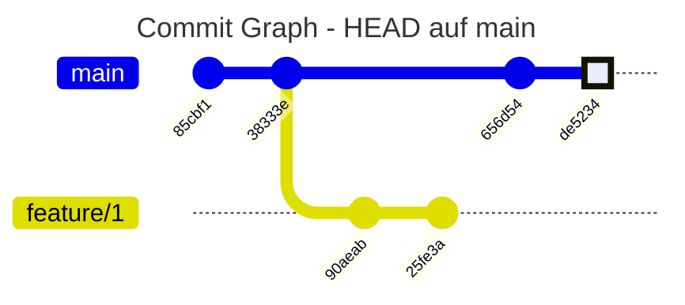

```bash
$ git checkout feature/1
```

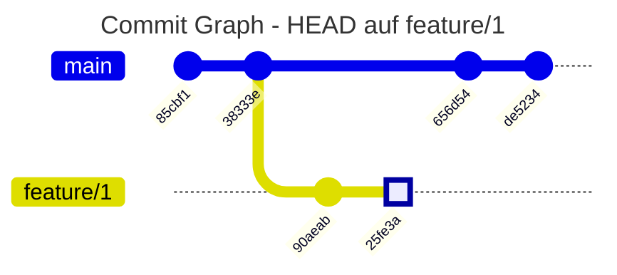

Passend zu unserem HEAD wir auch immer das Working Directory auf den Stand des HEADs gebracht. Das bedeutet, dass wir jetzt die Dateien aus dem Commit `feature/1` im Working Directory haben.

Was passiert wenn wir den HEAD direkt auf einen Commit setzten?

Bewegen wir uns doch auf einen Commit:

```bash
  $ git checkout 656d54
  > Note: switching to '656d54'.

    You are in 'detached HEAD' state. You can look around, make experimental
    changes and commit them, and you can discard any commits you make in this
    state without impacting any branches by switching back to a branch.


    HEAD is now at 656d54
```

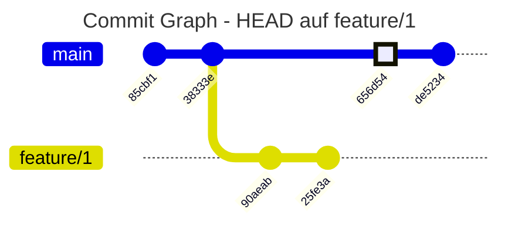

An sich kein Problem. Der HEAD zeigt jetzt auf den Commit `656d54` und unser Working Tree ist auf dem passenden Stand gebracht. Aber warum werden wir darauf hingeweisen dass wir jetzt in einem "detached HEAD" Zustand sind? Und was ist das überhaupt?

Braches zeigen immer auf den letzten Commit ihres Zweiges. Und Branches sind die einzigen Orte an denen wir neue (erreichbare) Commits erstellen können. "detached HEAD" beschreibt also den Zustand indem wir nicht mehr direkt auf einen Branch verweisen und somit auch keinen neuen Commit erstellen sollten.

> ‼️ Achtung: Commits sind nur über Branches erreichbar. Im "detached HEAD" können wir zwar Commits erstellen, aber sie sind nicht erreichbar. Um sie dauerhaft erreichen zu können müssen wir sie einen neuen Branch erstellen (`git branch <branch_name>`). Solltet ihr das vergessen wird euch git beim nächsten Checkout auf einen Branch darauf hinweisen. Falls ihr das vergesst ist es Zeit die Seite [Help! I fucked up](./help.md) zu lesen.

> Solltet ihr noch einen ältere Version von git haben, ist der Hinweis noch deutlich dramatischer und warnt deutlich agressiver, dass Commits verloren gehen können. "detached HEAD" ist aber ein normaler Zustand und kein Grund zur Panik. Wenn ihr ihn wieder verlassen wollt, könnt ihr einfach auf einen Branch wechseln. Zum Beispiel mit `git checkout main`.

### Relative Commits

Navigation mit Commit Hashes ist nicht immer das angenehmste. Warum sollte man eine komische Buchstaben und Zahlenkombination erst im Log raussuchen und dann eingeben um einfach einen Commit zurück zu gehen. Hier kommen Relative Pfade ins Spiel.

Mit `<branch/commit>~` bzw. `<branch/commit>~n` kannst du einen bzw `n`-Schritte dem Commit Graphen folgen.

Schauen wir uns ein Beispiel an.

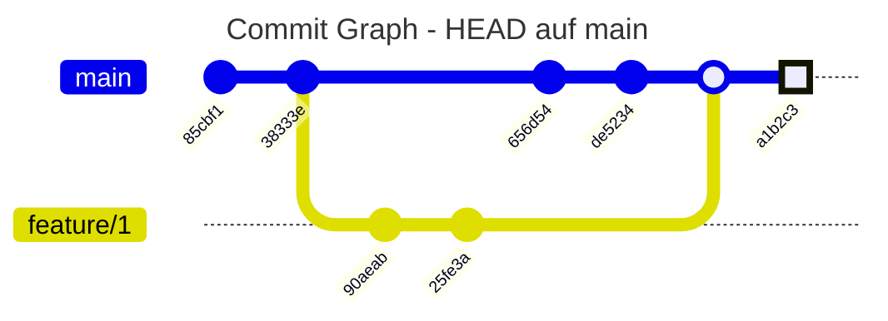

```bash
$ git checkout main~3
```

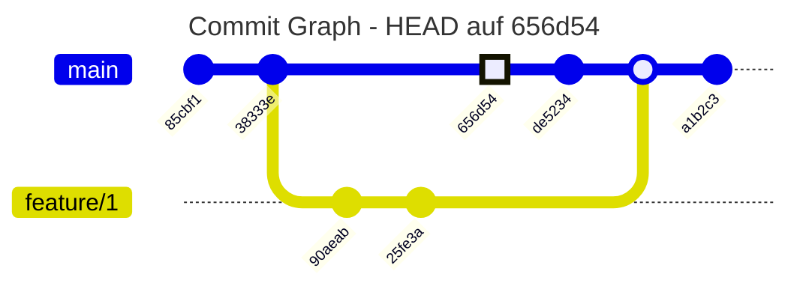

Aber wie kommen wir bei einem Merge Commit auf den richtigen Commit? Schließlich führt ein Merge Commit auf zwei verschiedene Commits zurück. Unser bereits bekannter `~`-Operator wählt hier immer den Hauptstrang - auf den gemergt wurde - aus. Wenn wir den anderen Zweit auswählen wollen, können wir den `^`-Operator verwenden.


```bash
$ git checkout main~1^~
```

> `~` folgt dem Hauptstrang, `^` folgt dem Nebenstrang Strang. Aber `^n` folgt nicht solange dem Hauptstrang bis es einen Nebenstrang gibt, sondern versucht den `n`-ten Elternknoten zu finden. Das spielt erst eine Rolle wenn ein merge mehr als zwei Eltern hat.

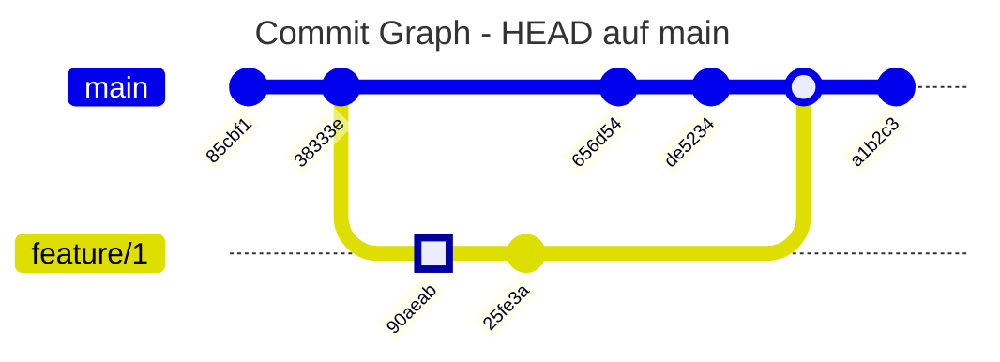

# Reset

Du hast Änderungen commited die du nicht commiten wolltest? Der Staging Area zu viel hinzugefügt? Euer Softwareprojekt läuft seit deinen letzten Änderungen gar nicht mehr? Dann bist du hier richtig. Alles was du gemacht hast lässt sich auch wieder Rückgängig machen.

Reset gibt es in verschiedenen Formen:

- soft
- mixed
- hard

Ähnlich zu Checkout verändert Reset den Working Tree sowie die Staging Area. Aber im Gegensatz zu Checkout scheint Reset nur den HEAD zu verändern. In Wirklichkeit verschiebt Reset nur den zugrundeliegenden Branch und damit indirekt auch den HEAD. Dieser Unterschied ist wichtig. Während wir einen Checkout durch einen anderen Checkout sehr einfach rückgängig machen können, ist das beim Reset komplizierter, da wir keine Branch mehr haben die auf die alten Commits zeigt. Sollte dir das aus Versehen passieren, lies dir die Seite [Help! I fucked up](./help.md) durch.

### Soft Reset

Ein Soft Reset verändert nur den Branch Pointer und hat ansonsten keine Auswirkungen. Somit setzt es nur den letzten Commit Befehl zurück. Die Staging Area enthält alles was in dem Commit enthalten war. Wir schauen uns das ganze an einem Beispiel an.

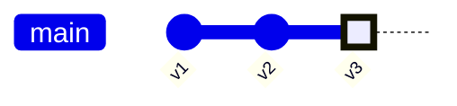

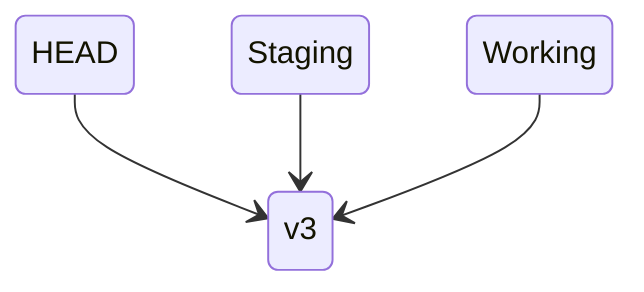

```bash
$ git reset --soft HEAD~
```

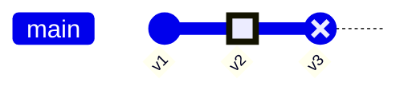

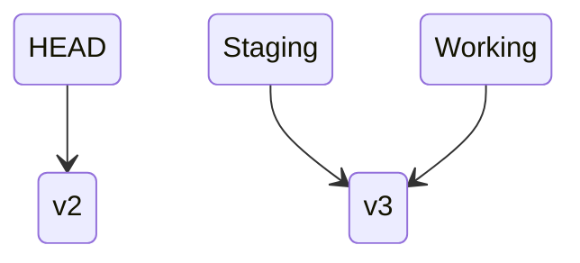

> Alle git Befehle können auch immer mit relativen Commit Referenzen (`~` und `^`) aufgerufen werden. Grade bei Reset bietet sich das an, weil man meist nur wenige Commits zurück will. Zum Beispiel `git reset --soft HEAD~`

### Mixed Reset

Bei einem Mixed Reset wird wie zurvor auch beim Soft Reset zunächst der HEAD auf den angegebenen Commit zurückgesetzt. Danach wird der neue HEAD in die Staging Area geladen. Somit wird der letzte Commit rückgängig gemacht und auch die Staging Area wird geleert. Alle Änderungen im Working Tree bleiben erhalten.


```bash
$ git reset --mixed HEAD~
# oder
$ git reset HEAD~
```


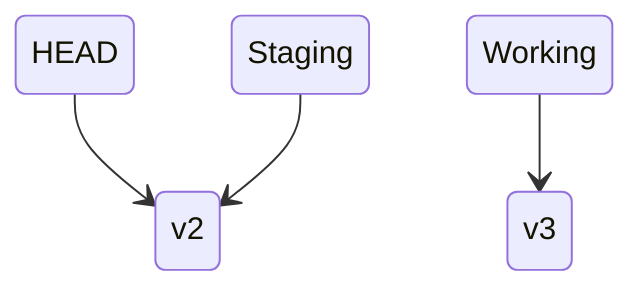

### Hard Reset

Ein Hard Reset ist die weitgehendste Form des Resets. Hier wird der HEAD auf den angegebenen Commit gesetzt und die Staging Area, sowie der Working Tree mit diesem Commit überschrieben.

> Achtung: Uncommitede Änderungen im Workiung Directory gehen vollständig verloren. Dies ist der einzige Befehl mit dem git Dateien unwiederbringlich löscht. Bitte gehe mit Option `--hard` vorsichtig um.


```bash
$ git reset --hard HEAD~
```


```mermaid
stateDiagram-v2
    HEAD --> v2
    Staging --> v2
    Working --> v2
```

In keinem der Fälle wird ein Commit direkt gelöscht. Wie du einen reseteten Commit wiederherstellen kannst, erfährst du [hier](./help.md).

## Reset mit Dateipfad

Reset kann zusätzlich zu dem Commit auch mit einem Dateipfad aufgerufen werden. Der Syntax dafür schaut wie folgt aus:

```bash
$ git reset <commit> <file>
```

Aber was passiert hier eigentlich? HEAD bzw. der Branch der zugrundeliegt sind Pointer und können somit immer nur auf einen Commit zeigen. Sie können also nicht mehrere Commits für unterschiedliche Datein referenzieren. Dementsprechend wird bei einem Reset mit Dateipfad die Branch nicht verändert. Die Staging Area und der Working Tree hingegen können ganz unterschiedliche Datein enthalten. Der Reset Befehl setzt also nur die angegebene Datei auf den spezifizierten Commit zurück. Ob auch der Working Tree vom Reset betroffen ist, hängt von der gewählten Reset Art ab.

> `git reset HEAD <file>` nimmt die Datei aus der Staging Area bzw. überschreibt die Datei in der Staging Area mit der Datei aus dem letzten Commit. Der Working Tree bleibt unverändert.
> Wer es noch kürzer mag, kann auch das HEAD weglassen. `git reset <file>` hat den gleichen Effekt.

In unserem Beispiel setzten mir die Datei `file.txt` auf den Stand des letzten Commits zurück.

```mermaid
gitGraph

commit id: "v1"
commit id: "v2"
commit id: "v3" type: HIGHLIGHT
```

```mermaid
stateDiagram-v2
    HEAD --> v3
    Staging --> v3
    Working --> v3
```

```bash
$ git reset HEAD~ foo.txt
```

```mermaid
gitGraph

commit id: "v1"
commit id: "v2" type: HIGHLIGHT
commit id: "v3" type: REVERSE
```

```mermaid
stateDiagram-v2

    x: v3
    y: v3
    z: v2 - foo.txt \n v3 - rest

    HEAD --> y
    Staging --> z
    Working --> x
```

> Soft Reset macht mit Dateinamen keinen Sinn, da der Pointer auf den Branch bleibt.

# Squashing

Oftmals schreibt man auf einer Branch mehrere Commits die man vor einem Merge der Übersicht halber lieber zusammenfassen möchte. Das Zusammenfassen mehrerer Commits in einen Commit nennt man Squashing. Meistens führt man Squashing mittels eines interakiven Rebase durch. Wie das funktioniert schauen wir uns auch später an. Aber für denn Fall, dass wir die letzten Commits zusammenfassen wollen, können wir auch einen einfachen Reset verwenden.

Wir gehen wie folgt vor:

1. Soft Reset auf den Commit vor den Commits die wir zusammenfassen wollen
2. Neuer Commit erstellen

In unserem Beispiel wollen wir die letzten beiden Commits zusammenfassen.

```mermaid
gitGraph

commit id: "v1"
commit id: "v2"
commit id: "v3" type: HIGHLIGHT
```

```mermaid
stateDiagram-v2
    HEAD --> v3
    Staging --> v3
    Working --> v3
```

```bash
$ git reset --soft HEAD~2
```

```mermaid
gitGraph

commit id: "v1" type: HIGHLIGHT
commit id: "v2" type: REVERSE
commit id: "v3" type: REVERSE
```

```mermaid
stateDiagram-v2
    HEAD --> v1
    Staging --> v3
    Working --> v3
```

In der Staging Area und im Working Tree befinden sich nun die Änderungen aller Commits die wir zusammenfassen wollen. Jetzt müssen wir nur noch einen neuen Commit erstellen.

```bash
$ git commit -m "Squashed commit"
```

```mermaid
gitGraph

commit id: "v1"
commit id: "v4" type: HIGHLIGHT
```

Wir haben erfolgreich die letzten beiden Commits in einen Commit zusammengefasst.

# Stashing

- Checkout funktioniert nur wenn die Staging Area und der Working Tree auf dem Stand vom letzten Commit sind
- Manchmal nehmen wir änderungen vor die noch nicht commit-bereit sind, müssen aber an was anderem arbeiten / branch wechseln
- Stashing speichert die Änderungen in einem temporären Commit der unabhängig vom Commit Tree ist und setzt Working Directory und Staging Area zurück

Beispiel:

```bash
$ git status
> Changes to be committed:
    (use "git reset HEAD <file>..." to unstage)

	  modified:   bar.txt

  Changes not staged for commit:
    (use "git add <file>..." to update what will be committed)
    (use "git checkout -- <file>..." to discard changes in working directory)

	  modified:   src/foo.txt
```

Wir wollen jetzt Branch wechseln, aber die Änderungen in `src/foo.txt` sind noch nicht commit-bereit. Mit `git-stash` können wir die Änderungen temporär speichern.

```bash
$ git stash
> Saved working directory and index state \
   "WIP on master: 049d078 Create index file"
  HEAD is now at 049d078 Create index file
  (To restore them type "git stash apply")
```

Working Tree und Staging Area sind jetzt wieder auf dem Stand vom letzten Commit und damit bereit den Branch zu wechseln. Wir können das mit `git status` überprüfen.

```bash
$ git status
> On branch main
  nothing to commit, working directory clean
```

Wir können jetzt nach belieben Branch wechseln und wo anders weiterarbeiten.

Um unsere akutellen Stashes anzuzeigen könnnen wir `git stash list` verwenden.

```bash
$ git stash list
> stash@{0}: WIP on master: 049d078 Create index file
> stash@{1}: WIP on master: 3923d03 Revert add file size
```

Hier sehen wir das wir zwei Stashes haben. Den oberen haben wir grade erstellt. Um die Stashes unterscheiden zu können fügt git immer die Commit Message des letzten Commits hinzu. Wahlweise kann sie auch bei der Erstellung mit der Option `-m` angegeben werden (z.B. `git stash -m "Meine Nachricht"`).
Um einen Stash kann auf einer beliebigen Branch wiederhergestellt werden, jedoch kann es bei der Anwendung zu Konfliken kommen. Wie diese gelöst werden schauen wir uns im Kapitel [Branching und Merging](./git/branching_und_merging.md) an.

Um unseren Stash auf den aktuellen Working Tree und Staging Area anzuwenden verwenden wir `git stash apply`. Sollten wir nicht den letzten Stash anwenden wollen müssen wir die ID mit `git stash apply stash@{1}` angeben.

```bash
$ git stash apply stash@{0}
> On branch master
  Changes not staged for commit:
    (use "git add <file>..." to update what will be committed)
    (use "git checkout -- <file>..." to discard changes in working directory)

	  modified:   bar.txt
	  modified:   src/foo.txt

  no changes added to commit (use "git add" and/or "git commit -a")
```

Wenn wir den Stash nicht mehr benötigen können wir ihn mit `git stash drop stash@{0}` löschen. Für alle Stashes funktioniert das mit `git stash clear`.
