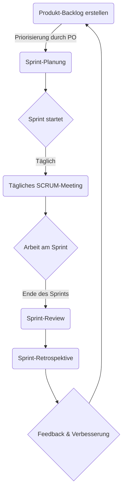

# SCRUM

SCRUM ist ein agiles Framework, das Teams dabei unterstützt, Softwareprojekte in iterativen und inkrementellen Zyklen, den so genannten Sprints, zu bearbeiten. Ziel ist es, den Entwicklungsprozess flexibel zu gestalten, um schnell auf Änderungen reagieren zu können und das Endprodukt Schritt für Schritt zu verbessern. Vermutlich werdet ihr so im Teamprojekt euere einzelnen Aufgaben priorisieren und abarbeiten. Wir schauen uns hier den Prozess im Detail an:

1. **Produkt-Backlog erstellen**: Der Product Owner (PO) ist zuständig für die Erstellung und Priorisierung des Produkt-Backlogs. Das Backlog umfasst alle Features, Funktionen, Anforderungen und Verbesserungen, die das Endprodukt enthalten soll. Der PO ist die Schlüsselverbindung zwischen dem Entwicklungsteam und den Stakeholdern (euer Teamleiter) und stellt sicher, dass die Arbeit des Teams maximalen Wert schafft.

2. **Sprint-Planung**: Zu Beginn jedes Sprints führt der Scrum Master, der als Facilitator des Prozesses dient, das Team durch eine Planungssitzung. Hierbei entscheidet das Entwicklungsteam, welche Aufgaben aus dem Produkt-Backlog im kommenden Sprint bearbeitet werden sollen. Diese Aufgaben werden dann in das Sprint-Backlog überführt. Die Aufgabenmenge wird so gewählt, dass sie das Team realistisch in einem Sprint, der in eurem Teamprojekt wahrscheinlich 1-2 Wochen dauert, abschließen kann.

3. **Der Sprint beginnt**: Während des Sprints arbeitet das Entwicklungsteam eigenständig an den Aufgaben, um die Sprint-Ziele zu erreichen. Der Scrum Master unterstützt das Team, indem er hilft, Hindernisse zu beseitigen und sicherstellt, dass das Team ungestört arbeiten kann.

4. **Tägliches SCRUM-Meeting**: Der Scrum Master moderiert das tägliche Stand-up-Meeting, in dem jedes Teammitglied Fortschritte, geplante nächste Schritte und mögliche Hindernisse diskutiert. Diese Meetings fördern die Kommunikation und schnelle Problemlösung.

> Täglich ist vermutlich nicht bei jedem Teamprojekt realisitisch. 2-3 mal pro Woche wäre aber auf jeden Fall sinvoll.

5. **Sprint-Review**: Am Ende des Sprints organisiert der Scrum Master ein Review-Meeting, bei dem das Team seine Ergebnisse dem PO und den Stakeholdern präsentiert. Dies ist ein wichtiger Moment, um Feedback zu sammeln und den Wert des Geleisteten zu demonstrieren.

6. **Sprint-Retrospektive**: Die Retrospektive ist eine Sitzung, in der das Team (geleitet vom Scrum Master) reflektiert, was gut lief und was in Zukunft verbessert werden könnte. Ziel ist es, den Entwicklungsprozess kontinuierlich zu optimieren.

7. **Der nächste Sprint beginnt**: Unter Berücksichtigung des Feedbacks und der Erkenntnisse aus der Retrospektive startet die Planung des nächsten Sprints, wobei der Zyklus von vorne beginnt.

> Im Teamprojekt werdet ihr vermutlich nicht alle Rollen aus SCRUM besetzen können. Der PO wird vermutlich euer Teamleiter sein, der Scrum Master könnte ein Teammitglied sein, das sich um die Organisation kümmert aber trotzdem noch als Entwickler fundiert. Der Rest des Teams sind die Entwickler.

