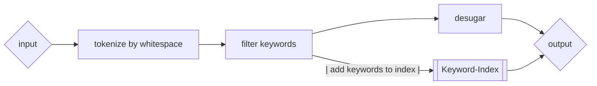

# Softwareentwicklung

> Hier geht es um das Schreiben von Software. Für Entwicklungsprozesse, siehe [hier](./scrum.md)

## Anforderungen

Bevor es losgeht, müssen wir uns überlegen, was genau wir eigentlich schreiben wollen. Hier reicht nicht nur eine grobe Idee, sondern es sollten ganz explizit die Use-Cases festgelegt werden.

#### Beispiel

"Wir schreiben eine App die es ermöglicht Rezepte zu verwalten."

> Das ist eine grobe Idee und sicher nicht genug um loszulegen. Arbeitet ganz explizite Use-Cases aus

Use-Cases könnten sein:

- Ein Arzt kann für Patienten Rezepte anlegen und Folgerezepte ausstellen
- Ein Patient kann Rezepte einsehen
- Ein Patient kann Folgerezepte anfordern
- Rezepteänderungen sind vom Patienten klar nachvollziehbar
- Die Apotheke kann Rezepte einsehen und als abgeholt markieren

Dies Use-Cases sind schon deutlich konkreter und ermöglichen es uns, konkrete Anforderungen abzuleiten. Diese Anforderungen sind dann die Grundlage für unsere Software:

- Es gibt drei Rollen in der App: Arzt, Patient, Apotheke
  - ein Artzt kann Rezepte anlegen und Folgerezepte ausstellen
  - ein Patient kann Rezepte einsehen und Folgerezepte anfordern
  - die Apotheke kann Rezepte einsehen und als abgeholt markieren
- Es gibt ein Rechte-System geben, dass die Rollen voneinander trennt
- Es gibt ein zentrales Login-System, dass Patienen authentifiziert
- ...

> Diese Anfangsphase ist grade im Teamprojekt sehr wichtig. Hier wird genau festgelegt, was und was nicht euer Projekt erreichen soll. Dokumentiert diesen Prozess klar und für alle Parteien verständlich. Missverständnisse in dieser Phase können später schnell zu größeren Problemem führen.

## Architektur

Bevor wir Anfangen Code zu schreiben, sollten wir uns überlegen wie wir den Code strukturieren wollen. Oftmals kommt es sonst zu einem Wildwuchs an einzelnen Teilen, die nur schwer zusammenpassen. Behaltet hier im Hinterkopf, dass unterschiedliche Personen parallel zueinander an dem Projekt arbeiten werden. Eine modulare Struktur macht euch euer Leben mit sehr viel weniger Merge-Konflikten leichter.

> Grade in größeren Softwareprojekten folgt die Architektur oft der Organisationsstruktur der Teams. Dies ist zwar nicht immer optimal im Sinner der Software. Einfaches parallels Arbeiten ist aber meistens wichtiger.

Zum Design bieten sich meist UML-Klassendiagramme-Diagramme (eher objektorientiert) oder Flowchart-Diagramme (eher funktional) zur Visualisierung an. Das kann zum Beispiel für einen lexer so aussehen:



## Implementierung

Nachdem die Anforderungen und die Architektur festgelegt sind, kann es an die Implementierung gehen. Die gorben Züge des Projekts sollten soweit feststehen, dass möglichst wenig böse Überraschungen warten.

Tendenziell gibt es zwei Arten Software zu implementieren:

- Top-Down: Vom groben Konzept zum Detail
- Bootom-UP: Von den Details zum groben Konzept

Beide Ansätze und ihre Mischformen sind in der Praxis zu finden. Im Teamprojekt würde ich dir einen Top-Down Ansatz deutlich ans Herz legen. Grade in Sprachen, die einem noch nicht so bekannt sind, werden sonst Details fein säuberlich ausgearbeitet, die später leider nicht zusammenfassen.

Wie also gehen wir vor? Wir die allgemeinsten Funktionen / Klassen als erstes und setzen platzhalter an die Stellen, die noch mehr in die Tiefe gehen. So arbeiten wir uns Schritt für Schritt in die Tiefe.

Hier ein sehr triviales Beispiel:

```rust
struct Record {
    first_name: String,
    last_name: String,
    age: u32,
    address: String,
}

// bekommt die den Dateipfad und gibt eine Liste an gelesenen Records zurück.
// Pro Zeile steht genau ein Record
// gibt eine leere List zurück, wenn die Datei nicht existiert
fn read_data(input: &str) -> Vec<Record> {
    if !is_file() {
        // gibt eine leere Liste zurück
        return vec![];
    }
    let file = read_file(input)
    let lines = split_lines(file);
    // wandelt die Zeilen in Records um
    // wandelt die Zeilen in Records um
    let records = lines.iter().map(read_record());
    // gibt die records zurück
    records
}
```

Wir starten mit einer sehr groben Struktur und rufen bei allem was komplizierter scheint eine Funktion auf, die sich dieses Problem löst. Für diese Funktionen schreiben wir im nächsten Schritt die Implementierung..

```rust
struct Record {
    first_name: String,
    last_name: String,
    age: u32,
    address: String,
}

// bekommt die den Dateipfad und gibt eine Liste an gelesenen Records zurück.
// Pro Zeile steht genau ein Record
// gibt eine leere List zurück, wenn die Datei nicht existiert
fn read_data(input: &str) -> Vec<Record> {
    if !is_file() {
        // gibt eine leere Liste zurück
        return vec![];
    }
    let file = read_file(input)
    let lines = split_lines(file);
    // wandelt die Zeilen in Records um
    // wandelt die Zeilen in Records um
    let records = lines.iter().map(read_record());
    // gibt die records zurück
    records
}

// checke ob der Dateipfad existiert und eine Datei ist
fn is_file() -> bool {
    match std::fs::metadata("file.txt") {
       Ok(it) => it.is_file(),
       Err(_) => false,
    }
}

// lese die Datei als String ein
fn read_file(input: &str) -> String {
    std::fs::read_to_string(input).unwrap()
}

// teile den String in ein einzelne Zeilen auf
fn split_lines(input: &str) -> Vec<&str> {
    input.split_lines().collect()
}

fn read_record(input: &str) -> Record {
    // deligiere die Arbeit an den Record. Diese Funktion muss erst noch erstellt werden.
    Record::from_str(input)
}


```

Diesem Prozess folgend, arbeitet wir uns immer Tiefer bis alle Probleme gelöst sind und wir ein funktionierendes Feature haben.
